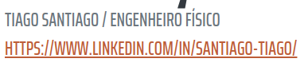

<h1>
    
    Formação DevOps Fundamentals
</h1>

# :computer: Desafio: Criando seu Primeiro Projeto de Devops com GitLab

Entrega do projeto

    1.	Criar uma conta no GitLab

    2.	Criar o repositório

    3.	Baixar o projeto Aula Devops Fundamentals – link acima

    4.	Copiar ao seu repositório ou fazer Fork do projeto original

    5.	Fazer alterações no projeto conforme mencionado na aula

    6.	Fazer commit em seu repositório

    7.	Enviar a url do projeto para validarmos

    8.	Comandos básicos para auxiliar:

    9.	Após instalar o GitBash:

    10.	git clone NOME DO SEU REPOSITORIO HTTPS
 
Acessar o codigo:

    1.	Acessar o repositorio baixado: cd aula-devops-fundamentals

    2.	Fazer alteração, incluindo seu nome

    3.  Para ver as alterações feitas: git status

    4.  Adicionar suas alterações: git add . 

    5.  Fazer o Primeiro Commit: git commit -m "Primeiro Commit"

    6.	Para enviar suas alterações ao seu repositorio: git push origin main 

GitLab do instrutor: https://gitlab.com/sandro.lechner/aula-devops-fundamentals

# :bulb: Solução do desafio

O objetivo do projeto é clonar um repositório, fazer alterações e enviar para o repositório próprio criado. Como já possuo conta, usei o github para adicionar o repositório.

Modificações:

